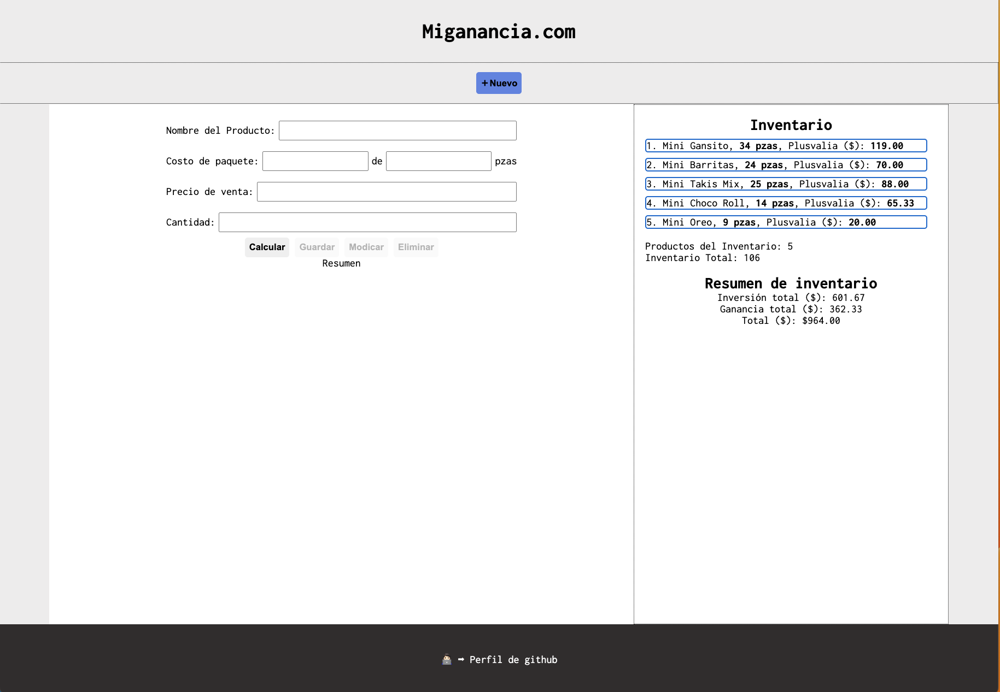

# 🧑🏻‍💻 Miganancia.com - novainc98

Miganancia.com te ayuda a calcular fácilmente las ganancias de tu negocio a partir de un ticket de compra. Solo captura los datos y obtendrás un resumen claro de lo que invertiste y cuánto estás ganando.

Puedes crear, modificar y eliminar registros dentro de el.

Este es un proyecto personal desarrollado como parte de mi aprendizaje en desarrollo web.

Nota: los datos se guardan en tu navegador y puedes perderlos si borras el historial.

## 📁 Contenido

- `index.html` — Página principal
- `styles.css` — Estilos visuales
- `script.js` — Funcionalidad de la aplicación
- `LICENSE.md` — Información detallada sobre los derechos de uso

## 🚀 Motivación

Este proyecto nació del deseo de apoyar a los micronegocios ofreciéndoles una herramienta simple para calcular sus ganancias.  
La idea es motivarlos al visualizar claramente cuánto están ganando con cada venta.

## 🧾 Versión

`miganancia.com` — versión 1.0

## 🛡️ Licencia

Este proyecto está licenciado bajo la **Creative Commons Atribución-NoComercial 4.0 Internacional (CC BY-NC 4.0)**.  
Consulta el archivo [LICENSE.md](./LICENSE.md) para más detalles.

© 2025 novainc98  
🔗 Perfil: [https://github.com/novainc98](https://github.com/novainc98)
